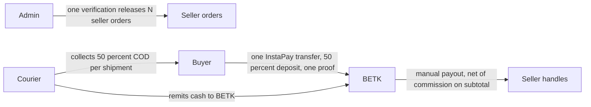

# E-1 — Legal gate pack

**Input for Egyptian counsel. Not legal advice. Contains no compliance findings. Every legal point is a question.**

This file is an engineering fact summary plus questions. It does not answer them.

---

## 0. Method

Written 2026-09-23 on branch `v2-e1-legal-gate-pack`, cut from `origin/main` `f41e985` (merge of PR #64). Stage C approval commit on that tip: `ac392d8` (approved content `3bec2ea`). This task mints no register row, no scope decision, and no architecture decision. Re-read of the register header in `docs/10-ai-development/SESSION_CONTEXT.md` (standing-facts numbers bullet and the register heading): highest row REG-92, next free **REG-93** / **OD-22** / **ADR-026**. Unchanged.

### 0.1 Rules this file follows

- R1. Nothing here is legal advice or a finding. This file never states that a design is acceptable or sufficient. Every legal point is a question for counsel.
- R2. No legal research. No statute, article, threshold, fee, period, or regulator is stated as fact. A candidate body or instrument appears only inside a question and is tagged **[unverified — counsel to confirm]**. Q1 names the Central Bank of Egypt because the kickoff named it.
- R3. Every product fact is cited: file + section, or a measured query with method and timestamp. An uncited fact is marked **UNPINNED** or left out.
- R4. Scope is frozen: 51 tables (OD-20) and 79 pages (OD-21). A risk that could force a scope or model change is flagged in §5. It is not resolved, designed around, or turned into a requirement.
- R5. No user data. Schema fields, roles, and key names only. No row values, staging identifiers, emails, or phone numbers.
- R6. Live staging has 43 tables. The 8 v2 tables in `BETK_ERD.md` §6.1, and the new columns in §6.2–§6.3, do not exist yet. Every data field is **LIVE** (introspected) or **TARGET** (ERD cite).

### 0.2 Banned phrases

The following strings are banned everywhere in `docs/01-product/legal/` except this list:

- compliant
- complies
- compliance with
- lawful
- legally required
- legal requirement
- permitted under
- exempt
- satisfies the law
- no licence needed
- no license required

### 0.3 Measured-at

All SQL below is `execute_sql` with a single `SELECT`, namespace `project-0-BETK-supabase-betk`. No migration was applied.

Session clock: `SELECT clock_timestamp() AT TIME ZONE 'UTC'` → **2026-09-23 20:29:06.474068 UTC**. The column inventory, bucket list, storage-policy list, enum labels, and `admin_settings` status classification ran in that same session (the clock call sits in the middle of that batch).

`get_project` is **not** in that namespace’s tool catalog (catalog inspected this window). It was not called. Hosting region is therefore not measured. See §1.5.

`admin_settings` status query (keys only; values not printed):

```sql
SELECT key,
  CASE
    WHEN value = '' THEN 'empty'
    WHEN value = '0' THEN 'sentinel-zero'
    WHEN value = '48' THEN 'sentinel-48'
    ELSE 'other-not-printed'
  END AS value_status
FROM betk.admin_settings
ORDER BY key;
```

Column inventory: `information_schema.columns` for schemas `auth`, `betk`, `betk_analytics`, `storage`, filtered to personal-data name patterns plus the tables named in §1.3. `betk_analytics` returned no column under that filter.

Storage: `SELECT id, public FROM storage.buckets`. Policies: `SELECT policyname, cmd FROM pg_policies WHERE schemaname = 'storage' AND tablename = 'objects'`.

Enums: `pg_enum` for `betk.doc_type`, `betk.payment_method`, `betk.payout_method`.

GitHub (2026-09-23, `gh` authenticated as the repo owner, read-only):

- `gh api repos/Jovo-Jovi/betk/branches/main/protection --jq .required_status_checks.contexts` → `["RLS smoke (staging)"]`
- `gh api repos/Jovo-Jovi/betk/rulesets` → `[]`

Branch protection was not changed.

### 0.4 Sources read (cited, not re-derived)

`BETK_MVP_SCOPE.md` §3.12, §8 (N26), §9. `BETK_PRD.md` R-G01–R-G08, AC-AGR-1–5, R-O11–R-O29, R-K01–R-K09, R-V01–R-V04, R-U01–R-U05, R-S10, R-A07, R-E01. `BETK_ERD.md` §6.1–§6.3, §8, §13. `BETK_UI_SPEC.md` §4.a, §4.g, §5.1 (P67–P70), §6, plus the acceptance pages those sections name (P08, P15, P16, P23). `ADR.md` ADR-016, ADR-020–ADR-025. `OD8_CUSTODIAL_PAYMENTS.md` §11. `BETK_V2_SCOPE_BASELINE.md` §2.4–§2.7, §8, §9, §12. `BETK_V2_ROLE_JOURNEYS.md` §5.2–§5.6. `BETK_V2_SCHEMA_DELTA_PLAN.md` §0, §1.8, §8.2.5, §10 (header lines 3–5 left untouched). `BETK_PHASES.md` §4.f, §5. `SESSION_CONTEXT.md` rows REG-62, REG-75, REG-77, REG-85, REG-86, REG-88.

---

## 1. Product-facts annex

BETK is an Arabic-first marketplace aimed at Egypt. The buyer pays BETK. BETK later settles the seller, net of a commission on the goods subtotal. The seller does not accept the order. One cart becomes one master order, N seller orders, and N shipments (`BETK_MVP_SCOPE.md` §3.1–§3.2; `BETK_PRD.md` R-O12; `BETK_V2_SCOPE_BASELINE.md` §2.4).

LIVE means the column or table was present in `information_schema` this session. TARGET means `BETK_ERD.md` §6 and the object is not live yet. The live order table is `betk.orders`. The target name is `seller_orders` (rename, same relation; ERD §2.1, §6.2).

### 1.1 Money flow



| Step | Actor | Rail | Amount basis | Record | LIVE / TARGET | Cite |
|---|---|---|---|---|---|---|
| 1. Deposit | Buyer | InstaPay to BETK’s handle only. Vodafone Cash and Orange Cash are not buyer deposit rails. | 50% of (subtotal + delivery) for the **whole master**, one transfer, one proof. | `master_orders.proof_path`, `transfer_reference`, `proof_uploaded_at`. Handle key `admin_settings.betk_instapay_handle`. | Proof columns **TARGET** (table absent). Handle key **LIVE**, value status **empty** (§1.2). | `BETK_PRD.md` R-O15, R-O16, R-O18. Baseline §2.4. `BETK_UI_SPEC.md` P16. N22 in MVP_SCOPE §8. |
| 2. Allocation | Checkout writes two payment rows per seller order | Deposit row method `instapay`. Balance row method `cod`. | Master deposit = `round(master_total / 2, 2)`. Child deposits are the floored halves plus leftover piastres by largest remainder, tiebreak seller-order id ascending. Child balance = child total − child deposit. Sum of child deposits = the one transfer. | `payments.payment_type`, `payments.amount`, `payments.method`. | `payments` **LIVE**. The rounding rule is **TARGET** behaviour inside `checkout_from_cart` (function not live). | ADR-022. ERD §6.3. Baseline §2.4 (2 rows per seller order). |
| 3. Verify and release | Admin, one action | Same transfer | Confirms every deposit obligation under the master and releases every child. Seller is not asked to accept. | `orders.confirmed_at` today; target stamp is admin release, not seller acceptance. Trigger copies proof onto each deposit row and sets `payments.proof_snapshot_at`. | `orders.confirmed_at` **LIVE**. `proof_snapshot_at` **TARGET**. Buyer-written `payments.proof_path` is the **live** column; v2 stops the buyer writing it (ADR-021). | R-O19. ADR-021. ADR-016 (custody holds, with the v2 amendments in MVP_SCOPE §4.1). Journeys §5.5. |
| 4. Cash balance | Courier, per shipment, at delivery | Cash | 50% balance of that seller order | Admin confirms the balance **after** remit. Stamp `seller_orders.balance_confirmed_at`. | Column **TARGET**. | R-O20, R-K06, R-K08. ERD §6.2. |
| 5. Remit | Courier → BETK | **UNPINNED** as a stored record. No column in §6 is named as the remittance itself. Admin confirmation of the balance row is the stored fact. | The balance just collected | `payments.status` on the balance row moves to confirmed; `balance_confirmed_at` on the seller order. | `payments.status` **LIVE**. Stamp column **TARGET**. | R-O20. ERD §6.2–§6.3. |
| 6. Commission | Snapshotted at seller-order creation | Not a buyer rail | Flat % of **subtotal only**. Delivery is not in the commission base. Buyer does not see commission or the per-seller fee. Seller sees subtotal, commission, and net only. | `orders.commission_rate`, `orders.commission_amount` | **LIVE** columns. Rate key `commission_rate_pct` is **LIVE sentinel** (§1.2), not a chosen rate. | R-O27, R-O28, R-V02. ADR-020. Baseline §2.4. |
| 7. Seller settlement | Seller requests; admin processes. Manual. | Seller’s own InstaPay, Vodafone Cash, or Orange Cash handle | Derived net: `subtotal − commission_amount − refunded_subtotal`, after the return-hold timestamp, minus payouts already requested or processed. No wallet table. | `payouts.amount`, `payouts.method`, `payouts.account_details`. INSERT cap is a **TARGET** trigger. | `payouts` **LIVE**. Cap **TARGET**. `refunded_subtotal` **TARGET**. | R-O26, R-O09/R-O10 via R-O29. ERD §6.4. Baseline §2.4. REG-90 in SESSION_CONTEXT. |
| 8. Refund | Admin, per seller order, full or partial | Original custody (BETK already holds or held the money) | Goods portion on the seller order. Fee portion stays on `payments`. The two are not copies of each other. | `payments.refunded_amount` **TARGET**. `seller_orders.refunded_subtotal` **TARGET**. | Not live. | R-U04. ERD §3.10, §6.2, §6.3. |
| 9. Payout cap | Database, on INSERT | — | `available = Σ (subtotal − commission_amount − refunded_subtotal)` over eligible seller orders, minus `Σ payouts.amount` already requested or processed. | BEFORE INSERT trigger **TARGET**. Live CHECK on `payouts.amount` is `>= 100` (ERD §6.4). That CHECK is a schema fact, not a chosen business minimum; the settings key `min_payout_egp` is **set** and its number was not copied (§1.2). | Trigger **TARGET**. Table **LIVE**. | ERD §6.4. |

Courier principal: there is no courier login and no courier row-level policy. The handoff branch (admin session read, or a server-side service-role read) is not chosen (ADR-024; REG-78 mechanism open).

### 1.2 Custody period, as formulas

No duration below is a counsel period. Where a settings value is a sentinel or empty, the formula names the key and does not treat the sentinel as a decision.

Symbols:

- `proof_uploaded_at` — **TARGET** `master_orders.proof_uploaded_at` (ERD §6.1). Live analogue is `payments.proof_path` present on a pending payment (historical UI spec; v2 page P16 writes the master).
- `confirmed_at` — **LIVE** `orders.confirmed_at`. Target meaning: admin release (ERD §6.2).
- `delivered_at` — **LIVE** `orders.delivered_at`.
- `return_hold_hours` — **LIVE** `admin_settings` key. Status **sentinel-48**. REG-62 records the seed as the characters `48` and says `0` and empty string are “not yet configured”, and that this `48` is an engineering default, not a spec decision. REG-86: the key is **not** in the narrowed launch gate. Do not add it to that gate here.
- `payout_eligible_at` — **TARGET**. Stamped when status becomes `delivered`: `delivered_at + return_hold_hours` from `admin_settings` at that transition (ERD §6.2; plan §1.7, the paragraph after the trigger table). The seller reads the timestamp. The key stays admin-only.

Hold formula (target, not live):

`custody_after_delivery = payout_eligible_at − delivered_at = return_hold_hours` (the settings value at the delivery transition).

Manual payout is allowed in the product only when `payout_eligible_at` is set and `now()` is at or after it, and the balance is confirmed, and no blocking dispute or return, and the INSERT cap still has room (ERD §6.4; R-O29).

Branches:

| Branch | What the product does | Clock | Cite |
|---|---|---|---|
| Buyer cancel | Only before the proof is uploaded. After the deposit is confirmed, the exit is return, refund, or dispute, not cancellation. | Before `proof_uploaded_at` | Baseline §2.6. R-O22. Journeys §5.2. REG-73 closed on that quote. |
| No proof before the window ends | System cancels, restores stock, restores the cart under the quote rules, notifies. | `payment_deadline = checkout instant + payment_window_minutes`. Key is **not live** (absent from the measured key list). Plan §8.2.5: M3 inserts it as empty text and does not seed 30. Empty or not a positive integer: checkout writes nothing. | R-O21. Plan §8.2.5. Baseline §9 recommends 30 minutes at launch; that sentence is a recommendation, not a pin, and the plan refuses to seed it. |
| Proof rejected | Admin cancels, restores stock, refunds if the transfer was taken, notifies. | At reject | R-O23. Journeys §5.2. |
| Cancel after a confirmed deposit | Every such cancellation triggers a refund. The product calls that path launch-blocking. | After `confirmed_at` | R-O24. Baseline §2.6. |
| Seller cancel | The seller never cancels. Escalation is the only seller exit. The enum still contains `seller`; the trigger must not stamp it. | — | R-E01. ERD §5 `cancelled_by_type`. MVP_SCOPE §3.5. |
| Return | Does not restore stock. Refund may be full or partial per seller order. | `return_window_hours` is **not live**. Plan §8.2.5 inserts it empty. Empty: the return request is refused. It does not fall back to `return_hold_hours`. | R-U01–R-U05. R-L12. Baseline §2.7. Plan §8.2.5. |
| Payout | Waits for `payout_eligible_at`. | Formula above | R-O29. REG-86. |

`admin_settings` value status. LIVE rows are the measured classification. TARGET rows are absent from that result and are described only from plan §8.2.5 and the ERD.

| Key | Presence | Status | Cite |
|---|---|---|---|
| `betk_instapay_handle` | LIVE | **empty** | Measured. REG-62. Plan §8.2.5 (already empty, not re-seeded). Narrowed launch gate (MVP_SCOPE §9). |
| `betk_vodafone_cash` | LIVE | **empty** | Measured. REG-62. Not a buyer rail (R-O15). Dropped from the narrowed gate. |
| `betk_orange_cash` | LIVE | **empty** | Same. |
| `commission_rate_pct` | LIVE | **sentinel-zero** | Measured. REG-62 records `'0'` as not yet configured. Narrowed launch gate. Plan §8.2.5: not in the nine empty keys. |
| `delivery_fee_flat_egp` | LIVE | **sentinel-zero** | Measured. REG-62. Not the v2 buyer fee (fee is the courier matrix, R-K02). Not in the narrowed gate. |
| `return_hold_hours` | LIVE | **sentinel-48** | Measured class matches the REG-62 seed. Not a business decision (REG-62). Not in the narrowed gate (REG-86). |
| `dispute_sla_hours` | LIVE | **sentinel-48** | Measured. REG-62 names it only as the house pattern the return-hold seed followed. Not a counsel period. |
| `review_edit_window_hours` | LIVE | **sentinel-48** | Same. |
| `gold_level_min_orders`, `gold_level_min_rating`, `silver_level_min_orders`, `silver_level_min_rating`, `low_stock_default_threshold`, `max_listing_images`, `max_listing_tags`, `min_payout_egp`, `seller_approval_sla_hours` | LIVE | **set** (value not copied) | Measured `other-not-printed`. Numbers are not restated here. |
| `quote_tolerance_multiplier` | absent LIVE | TARGET seed **2** when M3 runs | Plan §8.2.5. N23 band is `[listing price, 2× listing price]` (MVP_SCOPE §8). |
| `quote_validity_hours` | absent LIVE | TARGET seed **24** when M3 runs | Plan §8.2.5. N23: quote valid 24h. |
| `prep_cap_days` | absent LIVE | TARGET seed **3** when M3 runs | Plan §8.2.5. ERD §6.3 “default meaning 3”. Admin-configurable (baseline §9). |
| `seller_category_limit` | absent LIVE | TARGET seed **3** when M3 runs | Plan §8.2.5. ERD §6.3. |
| `price_band_min_egp`, `price_band_max_egp` | absent LIVE | TARGET **empty** | Plan §8.2.5. Narrowed REG-62 gate includes the band. Empty: publish and quote send refuse. |
| `payment_window_minutes` | absent LIVE | TARGET **empty** | Plan §8.2.5. Not seeded as 30. |
| `return_window_hours` | absent LIVE | TARGET **empty** | Plan §8.2.5. Distinct from `return_hold_hours`. |
| `food_requirements` | absent LIVE | TARGET **empty** | Plan §8.2.5. Empty does not skip food approval (R-S10). |
| `agreement_buyer_terms_version`, `agreement_seller_agreement_version`, `agreement_return_policy_version`, `agreement_privacy_version` | absent LIVE | TARGET **empty** | Plan §8.2.5. ERD §6.3. Empty is not a current version. Which of the four block checkout is REG-88, not chosen here. |

### 1.3 Personal-data inventory

Retention as built, unless a row says otherwise:

- Account removal is deactivate-only. `betk.users.deleted_at` and `betk.users.anonymized_at` exist. MVP behaviour is deactivation and a blocked login. No hard delete and no anonymisation behaviour (OD-2, MVP_SCOPE §4.1 and the historical OD-2 paragraph). `anonymized_at` has no page that writes it (`BETK_UI_SPEC.md` P79, P09).
- `order_status_history` is append-only (`no_delete_order_history`, ERD §4). `moderation_logs` is append-only (`no_update_mod_log`, `no_delete_mod_log`, ERD §2.1).
- `storage.objects` policies measured this session: `docs_insert_own_prefix` (INSERT), `docs_select_own_or_admin` (SELECT), `media_insert_own_prefix` (INSERT), `media_select_own_prefix` (SELECT), `media_update_own_prefix` (UPDATE). **No DELETE policy** on `storage.objects`. Plan §0.7 says the same for docs UPDATE and DELETE.
- GoTrue row deletion on deactivate is **UNPINNED**. OD-2 names `betk.users`, not `auth.users`.

Readers follow ERD §8 unless noted. “Seller none” for buyer identity is N28 and the §9 proof. Courier is not an RLS role (ADR-024). Service role bypasses RLS for jobs (ERD §8 intro). Admin label read is the admin’s own policy, not a courier policy (plan §1.8, ADR-024).

| Field | LIVE / TARGET | Category | Who can read it | Retention | Cite |
|---|---|---|---|---|---|
| `betk.users.phone_number` | LIVE varchar, nullable | contact | Self or admin (ERD §8 `users`). | Deactivate-only (OD-2). | Measured. UI P78, P09. |
| `betk.users.auth_provider` | LIVE enum `phone` \| `google` | identity origin | Self or admin. | Deactivate-only. | Measured. ADR-008 holds via ADR file disposition. |
| `betk.users.deleted_at`, `anonymized_at`, `last_login_at` | LIVE timestamptz, nullable | account state | Self or admin. `anonymized_at` unused. | The column is the deactivation mark, not an erasure. | Measured. OD-2. P79. |
| `betk.buyer_profiles.full_name` | LIVE | identity | Self or admin. Not public (ERD §8; public name branch struck, §9). | Deactivate-only. No anonymise write. | Measured. P08. |
| `betk.buyer_profiles.governorate`, `city` | LIVE (`city` nullable) | address | Self or admin. Seller path **NO** (ERD §9). | Deactivate-only. | Measured. §9. |
| `betk.addresses.label`, `governorate`, `city`, `street_address`, `building_notes` | LIVE | address | Self or admin. Seller **NO**. Buyer’s own book is the buyer’s (ERD §3.9 clarification in §8). | Buyer may DELETE own address rows (ERD §8 DELETE = self). That is not account erasure. | Measured. §8, §9. |
| `betk.orders.buyer_id`, `delivery_address_id` | LIVE uuid | identity key only | Buyer, store, or admin may SELECT the seller-order row, so the seller SELECT includes the bare uuids. Name and phone do not resolve (ERD §9). Pages must not render them (UI §4.a). | Append-only history blocks deleting the order cluster. | Measured. ERD §6.2 KEPT. |
| `betk.orders.notes`, `cancellation_reason` | LIVE text, nullable | free text (may contain personal data) | Same SELECT as the order row. | History append-only; order DELETE none (ERD §8). | Measured. |
| `betk.stores.name_ar`, `name_en`, `bio_ar` | LIVE | identity (store) | Public if the store is active, plus owner and admin (ERD §8). | No DELETE policy on `stores` (ERD §8 DELETE none). | Measured. |
| `betk.stores.governorate`, `city` | LIVE (`city` nullable) | address (public zone) | Public on an active store. This is the courier-rate origin (ADR-023). It is not the buyer’s address. | Same as store. | Measured. ADR-023. |
| `betk.stores.payment_methods` | LIVE jsonb | financial handle | Owner or admin for the owner update path. Public storefront must not render it (UI P05). | Same as store. | Measured. UI P05. REG-63 `cod_enabled` stays inside the jsonb. |
| `betk.seller_documents.storage_path` | LIVE text | government ID today; food photos and social URL are TARGET enum members | Own seller or admin. Not public (ERD §8). | Docs bucket: no DELETE policy (measured). | Measured. `doc_type` live labels: `national_id_front`, `national_id_back` only (`pg_enum`). |
| `doc_type` members `food_packaging`, `food_label`, `food_expiry`, `food_social_url` | TARGET enum | food-verification images; `food_social_url.storage_path` holds a social URL | Same policy: own seller or admin. URL is admin-only versus a public profile (ERD §6.3). | Same bucket. | ERD §5, §6.3. R-S10. |
| `betk.payments.proof_path`, `transfer_reference` | LIVE | payment proof | Buyer (via the order) or admin. **Seller none** (ERD §8). | No storage DELETE policy. | Measured. ERD §8. |
| `master_orders.proof_path`, `transfer_reference`, `proof_uploaded_at` | TARGET | payment proof | Buyer self or admin. Seller none (ERD §8). | Buyer prefix in bucket `docs` (plan §1.8, UI P16). | ERD §6.1. |
| `master_orders.recipient_name`, `recipient_phone`, `snapshot_governorate`, `snapshot_city`, `snapshot_street_address`, `snapshot_building_notes` | TARGET | identity, contact, address | Buyer self or admin. Seller none. Courier sees them only on the label, and only through the unchosen handoff (ADR-024, R-K07). | No DELETE on `master_orders` (ERD §8). | ERD §6.1. R-V01. |
| `payments.proof_snapshot_at` | TARGET | proof timing, not the image | Admin confirm path. Seller none. | — | ERD §6.3. ADR-021. |
| `store_pickup_addresses.governorate`, `city`, `street_address`, `building_notes` | TARGET | address (seller pickup) | Own seller or admin. **Buyer none** (ERD §8). Courier label includes pickup (ADR-024). Street is not the rate key (ADR-023). | — | ERD §6.1. R-V03. |
| `payouts.account_details` | LIVE varchar | financial handle | Own store or admin (ERD §8). | DELETE none. | Measured. |
| `payouts.method` | LIVE enum `instapay` \| `vodafone_cash` \| `orange_cash` | financial handle kind | Same. | — | `pg_enum` this session. |
| `inquiries.buyer_first_message`, `special_requests` | LIVE | message content | Buyer, store, or admin (ERD §8). | DELETE none. | Measured. |
| `inquiry_messages.body` | LIVE | message content | Thread parties (buyer and store) and admin. | DELETE none. | Measured. ERD §8. |
| `order_messages.body` | LIVE | message content | Buyer, store, or admin. | DELETE none. | Measured. |
| `dispute_messages.body`, `disputes.description`, `resolution_notes` | LIVE | message content | Buyer, store, admin. | DELETE none. | Measured. |
| `returns.reason` | TARGET | message content | Buyer self, store, admin. | — | ERD §6.1, §8. |
| `return_evidence.storage_path` | TARGET | message / evidence image | Return parties or admin. | Bucket DELETE policy: none measured. Which bucket the path uses is **UNPINNED** (ERD names `storage_path`, not a bucket). | ERD §6.1. |
| `reviews.body`, `seller_reply` | LIVE | review content | Visible reviews are public. Seller must not join `buyer_id` to a name or a place (ERD §8, UI §4.b). | DELETE none. | Measured. |
| `review_photos.url` | LIVE | review content | Follows the review. | — | Measured. |
| `dispute_evidence.url` | LIVE | evidence image | Dispute parties or admin. Live policies on this table are **absent** (RLS on, zero policies; ERD §8). | — | Measured column. ERD §8. |
| `notifications.body`, `title` | LIVE | message content | Self or admin. | DELETE = self (ERD §8). | Measured. |
| `flagged_content.notes`, `moderation_logs.reason`, `moderation_logs.metadata` | LIVE | free text | Admin (`flagged_content` policies absent today; `moderation_logs` admin). | Moderation log append-only. | Measured. ERD §2.1, §8. |
| `otp_tokens.phone_number` | LIVE | contact | No client policy (ERD §8: service). Cleanup cron exists (plan §0.7 job `cleanup-otp-tokens`). | Cron deletes expired tokens. That is the built retention for this table. | Measured. Plan §0.7. |
| `betk.sessions.device_info` | LIVE jsonb, nullable | device | No client policy. Table is intentionally unused (ADR-010). | Unused. | Measured. ADR-010. |
| `auth.users.email`, `phone`, `raw_user_meta_data` | LIVE (GoTrue) | contact / identity | Not an ERD §8 table. ADR-010: GoTrue is canonical for auth. `betk.users` has **no** email column (measured). | Deletion behaviour **UNPINNED**. | Measured `information_schema`. ADR-010. |
| `auth.identities.email`, `identity_data` | LIVE | identity from the provider | GoTrue. | **UNPINNED**. | Measured. |
| `auth.sessions.ip`, `user_agent` | LIVE | device / IP | GoTrue. Not `betk.sessions`. | **UNPINNED**. | Measured. ADR-010. |
| `agreement_acceptances.ip`, `user_agent`, `version_label`, `accepted_at`, `user_id`, `document`, `status` | TARGET | device / IP optional; the rest is the acceptance record | Self or admin. INSERT self. No UPDATE, no DELETE (ERD §8). | New version = new row. UNIQUE `(user_id, document, version_label)`. | ERD §6.1. R-G04 (optional IP/device). |
| Bucket `docs` object name | LIVE bucket, `public = false` | payment proof and seller documents | SELECT: first folder = `auth.uid()` OR admin (`docs_select_own_or_admin`). | No DELETE policy. | Measured bucket id and policy names. Plan §0.7, §1.8. |
| Bucket `media` object name | LIVE bucket, `public = true` | listing / review / store images (product media; may depict a person) | SELECT own prefix (`media_select_own_prefix`). Public flag is true. | UPDATE own prefix. No DELETE policy. | Measured. |

`betk.orders` does not have recipient name, phone, or street columns (measured). Those snapshots are TARGET on `master_orders` only.

### 1.4 Third parties and processors

“WIRED” means an import and a call that can leave the process. “STUB” means the module exists and the provider HTTP call is a comment, not executed. “DECLARED” means a key name in `.env.example` or `supabase/functions/.env.example` only. Key **names** were read from those example files. No env file with values was opened. Regions were not measured (see §1.5).

| Name | Role for BETK | Data the code sends | Wiring | Region |
|---|---|---|---|---|
| Supabase (Postgres, GoTrue Auth, Storage) | Database, sign-in, file buckets | Rows in §1.3, including phone, email on `auth.users`, proofs, ID paths | WIRED (`@supabase/supabase-js`, `@supabase/ssr`) | **UNKNOWN — human to confirm** |
| Google OAuth | Sign-in provider beside phone OTP | The button calls `signInWithOAuth({ provider: "google" })`. Callback records `auth_provider = google` on `betk.users` and does not write an email there (no column). GoTrue’s `auth.users.email` / `identities` columns exist. What Google transmits beyond that is **UNPINNED**. | WIRED. `GoogleSignInButton.tsx`. Keys `GOOGLE_CLIENT_ID`, `GOOGLE_CLIENT_SECRET` declared in `.env.example`. | **UNKNOWN — human to confirm** |
| TorvoSMS | OTP text delivery | Recipient phone and a message that contains the one-time code. `countryCode` in the posted body is the characters `20` (`send-sms-hook/lib.ts`). | WIRED in `supabase/functions/send-sms-hook` (`fetch` POST). Hosted hook enablement is a dashboard step the config file says it does not push (`supabase/config.toml` `[auth.hook.send_sms]` comment). | **UNKNOWN — human to confirm** |
| PostHog | Product events | `distinctId` is the user id (UUID). Browser init sets autocapture off, pageviews off, `person_profiles: "identified_only"`. `identifyUser` sends that id only and has **no caller** outside its definition. Events also send ids such as `inquiry_id` and `listing_id`, not name, phone, or email (`posthog.ts`, `posthog.server.ts`). | WIRED (`posthog-js` init, `posthog-node` `capture`). | **UNKNOWN — human to confirm**. Code default host string if the env host is unset: `https://app.posthog.com` (`src/services/posthog.ts`). The live host was not read. |
| Sentry | Error reports | `Sentry.setUser({ id })` only. Init options do not set a personal-data flag (`SENTRY_INIT_OPTIONS` has `dsn`, `tracesSampleRate`, `debug`). Whether the SDK attaches an IP when that flag is absent is **UNPINNED**. | WIRED (`@sentry/nextjs`). | **UNKNOWN — human to confirm** |
| Resend | Transactional email, intended | `sendEmail(to, template, vars)` accepts a recipient address. `emails.send` is commented and not called. No caller of `sendEmail` was found in `src/`. | STUB. Keys `RESEND_API_KEY`, `RESEND_FROM_ADDRESS` in `.env.example`. | **UNKNOWN — human to confirm** |
| WhatsApp Cloud API | Template messages, intended | `sendTemplate` accepts a recipient phone. The HTTP call is a comment (`src/services/whatsapp.ts`). | STUB. Keys `WHATSAPP_API_TOKEN`, `WHATSAPP_PHONE_ID` in `.env.example`. Table `whatsapp_templates` is LIVE and admin-only (ERD §8). | **UNKNOWN — human to confirm** |
| `src/services/sms.ts` | Supplemental SMS, intended | Function accepts a phone and a body. HTTP call is a comment. This is not the OTP hook. | STUB. Key `SMS_PROVIDER_KEY` in `.env.example`. | **UNKNOWN — human to confirm** |
| Twilio | Named in local auth config | `[auth.sms.twilio] enabled = false` (`supabase/config.toml`). | DECLARED, disabled. Not the OTP path. | **UNKNOWN — human to confirm** |
| Bosta | Named in a courier stub | Input type includes sender and recipient name, phone, city, street, and a cash-collection amount (`src/services/courier.ts`). HTTP call is a comment. **Not** the v2 courier. ADR-024 has not chosen a courier. | STUB. Key `BOSTA_API_KEY` in `.env.example`. | **UNKNOWN — human to confirm** |
| Courier (v2) | Collects the parcel and the cash balance; label carries buyer name, phone, and address | No principal, no login, mechanism unchosen (ADR-024, R-K07). | Not wired. | **UNKNOWN — human to confirm** |
| Google Fonts via `next/font` | Font files at build | No user record in the import (`src/app/[locale]/layout.tsx`). | WIRED for fonts, not for accounts. | **UNKNOWN — human to confirm** |

### 1.5 Hosting regions

| Place | What was measured | Result |
|---|---|---|
| Supabase database | MCP catalog has no `get_project`. `pg_settings` name list includes `TimeZone`, `log_timezone`, and `cluster_name`. Those values were not read, and a timezone is not a cloud region. | **UNKNOWN — human to confirm** |
| Supabase Auth | Same project as the database. No separate region tool. | **UNKNOWN — human to confirm** |
| Supabase Storage | Same project. Buckets `docs` (public false) and `media` (public true) measured. | **UNKNOWN — human to confirm** |
| Application host | No `vercel.json` in the repo (glob `vercel.json`, 0 files, 2026-09-23). `next.config.ts` has no region key (search for `regions` / `preferredRegion` / `vercel`, no matches). | **UNKNOWN — human to confirm** |
| PostHog, Sentry, Resend, TorvoSMS, Google, WhatsApp, Bosta | No read-only tool in this window returned a data region. Env values were not opened. | **UNKNOWN — human to confirm** |

---

## 2. The four documents

Exactly these four. Content is for counsel to write. Engineering owns pages, capture, and the version gate (R-G07; MVP_SCOPE §3.12). This section does not say what a document is required to contain.

Version behaviour for all four: acceptance at signup for the buyer terms, and a version gate before an order can complete (N26, MVP_SCOPE §8 and §3.12). A version change needs a new acceptance (R-G06). Records cover buyers and sellers (R-G03). A seller’s row is not a substitute for a buyer’s row (AC-AGR-5). Users who already exist have no acceptance row; backfill versus a forced new acceptance is open (REG-75). Which of the four sit in the completion gate is open (REG-88). The table can store all four (ERD §6.1). Empty version keys fail closed and are not “skip this document” (plan §8.2.5).

### 2.1 Buyer Terms & Conditions

- Pages: public `/legal/terms` (P67). Acceptance is captured on `/auth/register` (P08), which inserts `agreement_acceptances` for the current buyer-terms version and does not finish signup without it (AC-AGR-1, R-G01). Checkout (`/checkout`, P15) reads acceptances and blocks completion until the current versions in the gate are accepted (R-G02, AC-AGR-2). P08 always takes buyer terms. P08 does not decide the other three (UI P08 binding).
- Codes: R-G01, R-G02, R-G05, R-G06, R-G07, FR-AGR-1, AC-AGR-1, AC-AGR-2, AC-AGR-4.
- Acceptance fields (TARGET `agreement_acceptances`): `user_id`, `document`, `version_label`, `status` (only `accepted` is pinned), `accepted_at`, optional `ip`, optional `user_agent` (ERD §6.1, R-G04’s field list is written for the seller agreement; the same columns exist for every document the table stores).
- Topics from §1 the text is asked to address: the 50% InstaPay deposit and one proof; the 50% cash balance collected per shipment; who holds the money between proof, `confirmed_at`, delivery, and payout; cancel only before proof; after confirmation the exit is return, refund, or dispute; the seller never cancels; quote validity 24h and the band `[listing price, 2× listing price]` (N23); the payment window key is empty; commission is not shown to the buyer.
- Pins the text depends on, still open: REG-88 (is this document in the completion gate — buyer terms are captured at signup regardless), REG-75, `agreement_buyer_terms_version` empty, `payment_window_minutes` empty.

### 2.2 Seller Agreement

- Pages: public `/legal/seller-agreement` (P68). The acceptance row is written from onboarding `/seller/onboarding` (P23), not from the public page (UI P68). Submit without the current seller-agreement acceptance is refused (AC-AGR-3, R-G04). Version key empty: submit refused (plan §8.2.5).
- Codes: R-G03, R-G04, R-G05, R-G06, FR-AGR-1, AC-AGR-3, AC-AGR-5, R-E01, R-O27, R-S10, R-V02, R-K05.
- Acceptance fields: same TARGET table. R-G04 names version, timestamp, seller identity, status, and optional IP/device.
- Topics from §1: commission is a flat percent of subtotal only, rate not set (sentinel zero); settlement to the seller’s own handles; derived balance and the payout cap; payout waits for `payout_eligible_at`; the seller sees no buyer name, phone, address, or city; the seller cannot cancel; food artefacts and an admin-only social URL when a food category is chosen; pickup address is admin and courier, not the buyer.
- Pins: REG-88 (whether this document is also in the buyer completion gate — not decided), REG-75, `agreement_seller_agreement_version` empty, `commission_rate_pct` sentinel, `return_hold_hours` sentinel and outside the narrowed launch gate (REG-86).

### 2.3 Return & Refund Policy

- Pages: public `/legal/returns` (P69). This is the platform page, not the store’s own return text and not the return-request flow. Whether checkout records an acceptance for it depends on REG-88. Store pages may show `stores.return_policy`. How that text relates to this page is open (REG-85, UI §4.f). Not decided here.
- Codes: R-G05, R-U01–R-U05, R-O22, R-O23, R-O24, R-L12, FR-RET-1, AC-AGR-4.
- Acceptance fields: TARGET `agreement_acceptances` can store `return_policy`. Whether a row is written at signup, at checkout, or not at all is REG-88. Not chosen.
- Topics from §1: return only on a delivered seller order, with reason and evidence in a dedicated table (not dispute evidence); seller accept leads to return and refund; seller reject leads to dispute and an admin decision; refund full or partial per seller order; stock is not restored on return; deposit already confirmed is not cancelled by the buyer; proof rejection and post-confirmation cancellation trigger a refund when a deposit was taken; `return_window_hours` empty; `return_hold_hours` is a payout wait, not the return window.
- Pins: REG-85, REG-88, REG-86, both hour keys as in §1.2.

### 2.4 Privacy Policy

- Pages: public `/legal/privacy` (P70). Guest-readable (AC-AGR-4). Whether it is inside the completion gate is REG-88. P08’s binding line names buyer terms, not this document.
- Codes: R-G05, FR-AGR-1, AC-AGR-4, R-V01–R-V04, OD-2, R-A07 (phone gate location is open: named holds are checkout, become-seller, and payout; add-to-cart is not decided, REG-79).
- Acceptance fields: TARGET row `document = privacy` if a later pin says to store one. Not chosen.
- Topics from §1: the inventory in §1.3; the processors and stubs in §1.4; every region in §1.5 is unknown; deactivate-only and unused `anonymized_at`; no storage DELETE policy; government-ID images; food social URL admin-only; courier label; PostHog and Sentry receive the user id; TorvoSMS receives the phone and the one-time code; Google sign-in; in-app messages rather than a counterparty phone link (UI §4.g).
- Pins: REG-88, REG-75, `agreement_privacy_version` empty.

---

## 3. Ten questions for counsel

Rank: an answer that could change the core model, then an answer that blocks launch, then an answer that shapes document text. Each question is only a question.

**Q1. Could change the core model.** Whether BETK holding buyer funds — the custodial deposit and the later cash remittance, for the periods in §1.2 — needs Central Bank of Egypt payment-services licensing **[unverified — counsel to confirm]**, or must run through a licensed partner.

- Facts: §1.1 steps 1–7; §1.2 formulas. OD8 §11: an alternative shape (a licensed PSP as collecting agent, BETK controlling release and not holding the funds) was presented and not selected. ADR-016 records the holding shape. This pack does not treat OD8 §11 as an answer.
- Why it matters: it is the one answer that can replace the holding model.
- Answer format: one of (a) holding as specified can proceed, (b) holding must go through a named kind of partner, (c) the holding shape should stop, with the reason stated as counsel’s advice. Name any permission only as counsel’s advice.
- If the answer is adverse: flag **F-1**.

**Q2. Could change the core model.** Whether a courier who is not an app user may collect the cash balance on BETK’s behalf and remit it to BETK, given that the handoff mechanism is not chosen.

- Facts: §1.1 steps 4–5; ADR-024; R-O20; R-K06; R-K08; R-K07 (label carries buyer name, phone, and address). The Bosta file is a stub and is not this decision (§1.4).
- Why it matters: the second half of every order is that cash leg. If that collection cannot be done this way, the 50/50 split changes.
- Answer format: yes or no for “courier collects and remits to BETK”, plus any condition counsel attaches (contract, licence of the courier, or a different collector). Do not choose branch 1 or branch 2 of ADR-024; that stays a product gate.
- If adverse: **F-2**.

**Q3. Could change the core model.** Whether BETK, holding the money and taking a commission while the seller prepares the goods, is the contracting party with the buyer, or the seller is, and whether the rule that the seller can never cancel (escalation only) can stand with that answer.

- Merged with “seller can never cancel” because both ask who bears the order once the deposit is confirmed. A separate question would repeat §1.1.
- Facts: §1.1 steps 3 and 6; R-E01; R-O19 (no seller acceptance); R-O27; ADR-016; N28 (seller does not see the buyer).
- Why it matters: an answer that the seller must be able to cancel, or that the seller must be the party who takes the buyer’s money, changes OD-8 and OD-14.
- Answer format: who counsel advises should be named as the seller of the goods in the buyer terms, and whether the no-cancel rule can remain. Not a clause.
- If adverse: **F-3**.

**Q4. Could change a frozen catalogue branch.** Whether informal home-food sellers can be approved on the artefact set the product already specifies (packaging, label, and expiry photos, plus an admin-only social URL).

- Facts: R-S10; ERD §5 and §6.3 TARGET doc types; live `doc_type` is only the two national-id sides (§1.3); `food_requirements` absent and TARGET empty (§1.2).
- Why it matters: food is in the frozen scope. An answer that this artefact set is not enough removes or rebuilds that branch.
- Answer format: the artefact set can be the approval file, or it cannot, with what is missing named as a question back to the product owner rather than as a new feature designed here.
- If adverse: **F-4**.

**Q5. Blocks launch.** Whether the personal data in §1.3 may be stored and processed with the processors in §1.4, given that every region in §1.5 is unknown, including cross-border hosting.

- Candidate instruments or registration duties: **[unverified — counsel to confirm]**. Not named here on purpose (R2).
- Facts: §1.3, §1.4, §1.5.
- Why it matters: launch of any phase that stores these fields waits on this answer. An answer that the current hosts cannot be used is a stack change.
- Answer format: a list of hosts that counsel needs named before advising, and a yes/no/not-yet on proceeding while regions are unknown. Not a hosting design.
- If adverse: **F-5**.

**Q6. Blocks launch.** What should happen to government-ID images and the rest of §1.3 when someone asks for erasure, given deactivate-only accounts, unused `anonymized_at`, append-only history, and no storage DELETE policy.

- Merged with “deactivate-only versus erasure” because the ID images are the sharpest case of the same retention fact.
- Facts: §1.3 retention note; OD-2; measured storage policies; `seller_documents.storage_path`.
- Why it matters: onboarding stores ID images before launch of seller approval. An erasure path the product does not have would touch OD-2.
- Answer format: counsel’s advised handling for (i) ID images, (ii) order history, (iii) the rest of the account, each as “keep / delete / anonymise”, plus any period as counsel’s number, not as a product pin.
- If adverse: **F-6**.

**Q7. Blocks launch of the agreement surfaces.** Whether a click-accept record — version label, timestamp, user id, status `accepted`, optional IP and user agent — is the form of acceptance to use for signup and for the seller’s onboarding signature, and what to do about accounts that have no row.

- Facts: N26; R-G01, R-G02, R-G04, R-G06; ERD §6.1; P08, P15, P23; REG-75; REG-88; version keys empty (§1.2).
- Why it matters: Phase 09 shows these documents and captures acceptance. Phase 11 reads the gate. The legal gate blocks **launch** of those phases, not the schema build (`BETK_PHASES.md` §5).
- Answer format: yes or no on this record shape; if no, the missing element named (without designing a new page). For existing users: one of “write rows with no new action”, “ask again at next sign-in”, “ask again before the next order”, or another form counsel names. For the gate: for each of the four documents, in or out. This pack does not pick.
- If adverse: **F-7**.

**Q8. Blocks launch of returns.** How buyer return or withdrawal sits next to: no stock restore on return; refund full or partial per seller order; buyer cannot cancel after the deposit is confirmed; the return window key is empty; the store’s own return text has no decided relationship to the platform policy.

- Facts: §1.1 step 8; §1.2 return branch; R-U01–R-U05; R-L12; R-O22; R-O24; REG-85; `return_window_hours` absent.
- Why it matters: Phase 15 launch shows return rules. An answer that stock must come back, or that the deposit must be reversible by cancellation, changes those rules.
- Answer format: a short map of “buyer action → money outcome → stock outcome” as counsel’s advice, and one relationship label for store text versus platform text (beside it / not shown / something else counsel names). Not a schema change.
- If adverse: **F-8**.

**Q9. Blocks launch of settlement, and shapes the seller agreement.** How commission and payouts to sellers who may not be registered for tax should be described, and whether the product’s payout step is missing a tax step.

- Facts: §1.1 steps 6–9; `commission_rate_pct` sentinel zero; payout to seller handles; no tax column was found in the personal-data inventory (not in the measured `payouts` or `seller_profiles` columns listed in §1.3). A dedicated tax table was not looked for beyond that inventory. If counsel needs a column search, say so in the answer rather than assuming absence outside those tables. **UNPINNED** outside §1.3’s tables.
- Why it matters: payouts are how sellers are paid. A withholding or registration step is not in the flow.
- Answer format: “no tax step in the product flow” or “a tax step is advised”, with the step named as advice. Any rate or threshold comes from counsel, not from this file.
- If adverse: **F-9**.

**Q10. Shapes the documents.** What minimum age, if any, the four documents should state, given that `buyer_profiles` has no birth-date column (measured columns: `full_name`, `governorate`, `city`, `interests`, `notification_prefs`).

- Facts: that column list. Signup captures name and governorate (P08). No age field is in §1.3.
- Why it matters: the documents will be read by people creating accounts. An answer that requires a birth date adds a field the frozen schema does not have.
- Answer format: an age number from counsel, or “no age statement”, and whether a birth-date field is advised. Not a migration.
- If adverse: **F-10**.

---

## 4. Open pins these answers inform

None of these pins is decided in this file.

### REG-88 — which documents block order completion

Register text (SESSION_CONTEXT, cited): R-G02 blocks order completion until the buyer has accepted the “current required versions”. R-G05 names four documents. Which of the four are in the gate is not pinned. `agreement_acceptances` can store all four. Do not hard-code the set.

Informed by **Q7** (and Q8 if counsel says the return policy is or is not in the gate). Answer shape the pin needs: for each of the four documents, in the gate or not. Phase 11 reads that pin and does not choose it (`BETK_PHASES.md` §4.f).

### REG-75 — existing accounts have no acceptance row

Register text: every user created during phases 01–06 signed up with no acceptance record. Decide backfill versus forced re-accept at first login. Owner: the work that builds acceptance. Open. Pin before the agreements work.

Informed by **Q7**. Answer shape: one of the three forms in Q7, or another form counsel names. Not chosen here.

### REG-85 — store return text versus the platform policy

Register text: the store return policy remains. How it relates to the platform Return & Refund Policy is unpinned. Do not invent override, replacement, or dual-display. Open. Pin before the returns phase, and before any edit that relates the two texts.

Informed by **Q8**. Answer shape: one relationship label, as in Q8. Not chosen here.

REG-86 (return-hold versus the narrowed launch gate) is not pinned here either. Q8 and Q1 use the key as a fact. Membership of the launch gate stays a product decision (REG-86).

---

## 5. Scope-risk flags

Flags only. No resolution, no design, no new register number, no new scope decision, no new architecture decision.

| Id | Trigger | What could change | Frozen items touched |
|---|---|---|---|
| F-1 | Q1 adverse | The holding model: who receives the deposit and the remitted cash. Tables and pages that assume BETK holds the funds (`payments`, payouts, checkout, admin verification). | OD-8, ADR-016, the 50/50 split in the product rules. |
| F-2 | Q2 adverse | The cash-balance leg: who collects it. | R-O20, R-K06, R-K08, ADR-024, OD-8. |
| F-3 | Q3 adverse | Who is named as selling the goods, and/or the rule that the seller cannot cancel. | OD-14, R-E01, R-O19, ADR-016. |
| F-4 | Q4 adverse | The food-seller branch of onboarding. | R-S10, `seller_documents` types, OD-19’s catalogue (products). |
| F-5 | Q5 adverse | Where personal data is hosted. | Not a table. Could force a stack change outside the frozen page and table lists. |
| F-6 | Q6 adverse | Deactivate-only accounts and retention of ID images and history. | OD-2, storage policies, append-only history rules. |
| F-7 | Q7 adverse | The acceptance record or a new signature step. | `agreement_acceptances` (TARGET, inside the 51), P08, P23, P67–P70 (inside the 79). |
| F-8 | Q8 adverse | Return, stock restore, or deposit cancellation. | R-U05, R-L12, R-O22, OD-12, the returns tables. |
| F-9 | Q9 adverse | A tax or seller-registration step on payout. | `payouts`, seller onboarding. A new table would touch OD-20. Not added here. |
| F-10 | Q10 adverse | A birth-date or age gate on signup. | `buyer_profiles`, P08. A new column is a schema change. Not added here. |

---

## 6. Out of scope

Counsel is not asked to:

- Choose the checkout document set, the backfill method, or the store-text relationship. Those stay open until a person pins them after the answers (§4).
- Choose the courier company or the handoff branch (ADR-024). The Bosta stub is not a request to adopt Bosta.
- Set commission, the price band, the payment window, the return window, or the return hold. Those are product pins or empty keys (§1.2).
- Add a table, a page, or a column. Counts stay 51 and 79.
- Treat the eight draft files under `drafts/` as proposed legal text. They are product-fact skeletons with blanks. They are not part of the question list.
- Review boosts, trademark registration of the name, or employment of staff. Those topics are not in the four documents’ product facts for this gate, and the question list stops at ten.
- Produce a finding that the current build is acceptable. The banner at the top is the whole of that point.
