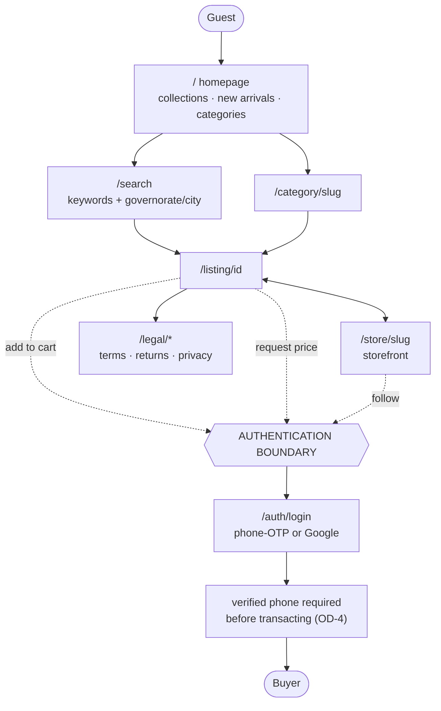
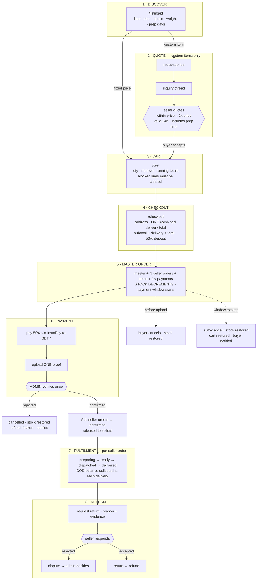
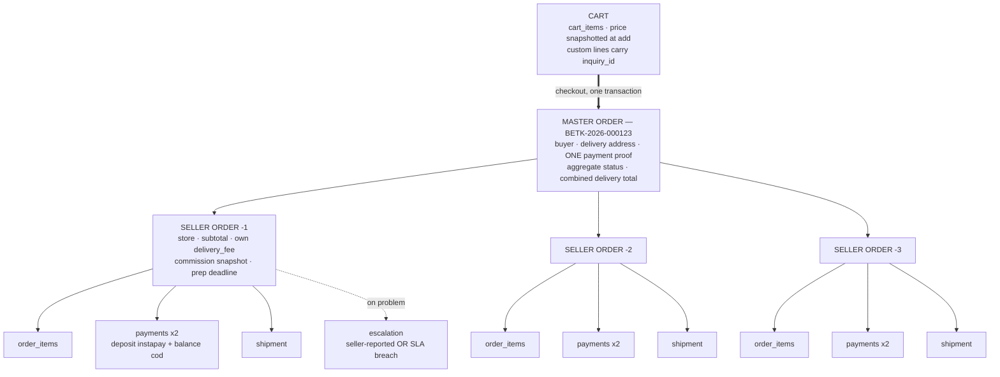
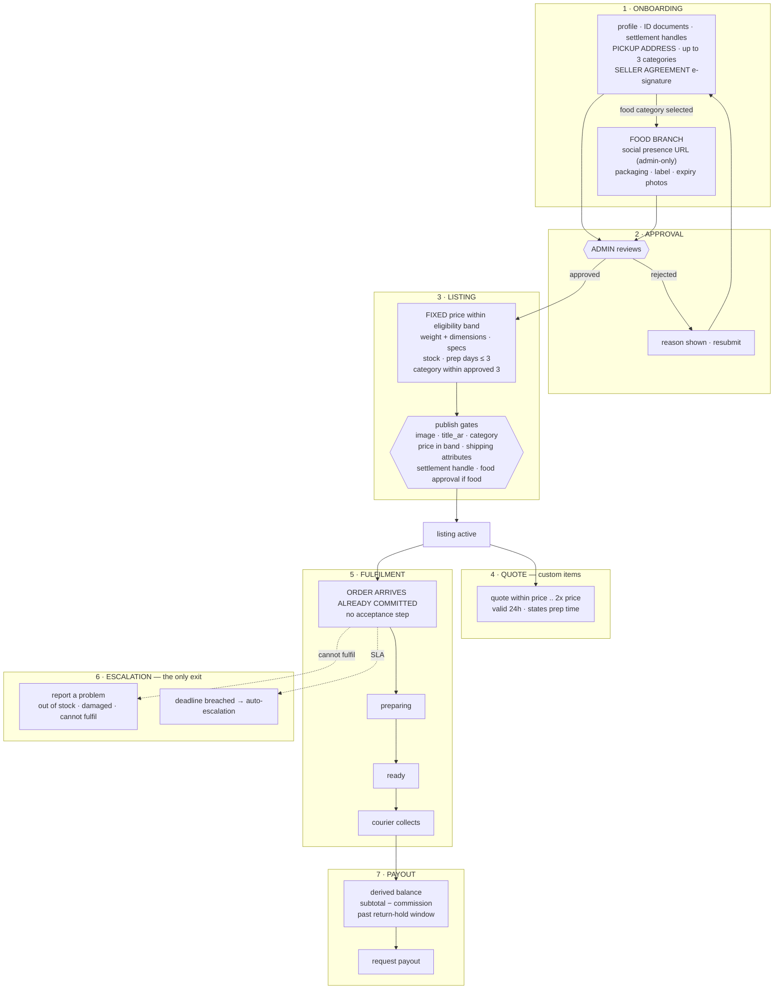
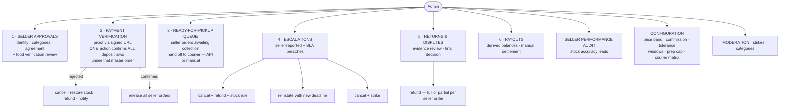
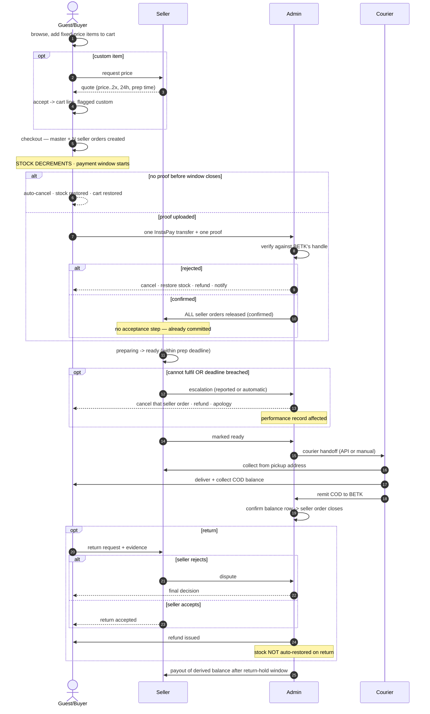

# BETK v2 — §5 ROLE JOURNEYS

> **Drop-in replacement for §5–8 of `BETK_V2_SCOPE_BASELINE.md`.**
> Collapses four disconnected flowcharts into one section with a clear hierarchy, and adds two views
> that did not previously exist: **5.3 Master Order Architecture** and **5.6 Cross-Role Lifecycle**.
>
> **Companion edit required in the parent document:** §3 (Domain model) should be reduced to its
> written *ownership rules* only. **5.3 below becomes the single canonical structural diagram** — two
> drawings of the same structure will diverge the first time something changes.
>
> **Renumbering:** merging §5–8 into §5 shifts everything below. Performance & audit → §6 ·
> Notifications → §7 · Legal → §8 · Configuration → §9 · Inventory → §10 · Disposition → §11 ·
> Gates → §12 · Open questions → §13 · Sign-off → §14.

---

## The v2 core concept

Everything in this section revolves around one structural change:

> ### One Cart → One Master Order → N Seller Orders → N Shipments

The buyer experiences a single purchase. BETK operates N independent fulfilments underneath it. Every
rule that follows — payment allocation, delivery pricing, prep deadlines, escalation, partial refunds —
exists to serve that split.

---

## 5.1 Guest Journey

**Browse → Listing → Authentication boundary**

**Guest can:** browse, search, filter, view any listing or storefront, read every legal page, share a
public link.
**Guest cannot:** add to cart, request a price, follow, wishlist.

Listing detail now always shows a **fixed price**, plus weight, dimensions, specs and prep days.
Custom items additionally show a *Request price* action.

**Open — N21:** guest cart held client-side and merged at login, or login required to add.

---

## 5.2 Buyer Journey

**Discover → Quote → Cart → Checkout → Master Order → Payment → Fulfilment → Return**

**Buyer sees:** one master order with per-seller sections progressing independently · one combined
delivery total · both payment states per seller order · full timeline from real history rows.

**Buyer never sees:** any seller address · BETK's commission · the per-seller delivery breakdown.

**Buyer may cancel only before uploading proof.** After the deposit is confirmed the exit is
return/refund/dispute, never cancellation.

---

## 5.3 Master Order Architecture

**One Cart → One Master Order → N Seller Orders → N Shipments**

*This is the canonical structural diagram. §3 carries the written ownership rules only.*

### Ownership

| Level | Owns |
|---|---|
| **Master order** | Buyer · delivery address · the single payment proof · aggregate status · the buyer-facing combined delivery total · the order number |
| **Seller order** | Items · its own delivery fee · its commission snapshot · its prep deadline · its shipment · its two payment rows · its escalation record · its cancellation and refund |

### Why the split is load-bearing

Each seller has a different pickup origin, a different courier fee, a different prep time, a different
delivery date, and can fail independently. **A single-order model cannot express partial fulfilment**,
and partial fulfilment is the normal case in a multi-seller cart.

### What is aggregated vs itemised

| | Buyer sees | BETK stores |
|---|---|---|
| Delivery fee | One combined total | Per seller order — needed for refunds and courier reconciliation |
| Payment | One transfer, one proof, one confirmation | 2 rows per seller order (2N total) |
| Status | Master aggregate | Independent per seller order |
| Commission | Never | Per seller order, snapshotted at creation |

---

## 5.4 Seller Journey

**Onboarding → Approval → Listing → Quote → Order Released → Fulfilment → Escalation → Payout**

### What the seller sees on an order

**Sees:** order reference · items and quantities · prep deadline.
**Never sees:** buyer name · phone · address · the buyer's other seller orders.

Questions go through the in-app order thread under a neutral label. BETK generates the courier's
label; the seller labels the box with the order reference only.

### Prep SLA

Deadline = `confirmed_at + MAX(prep_days)` across that seller order's items — max, not sum, because a
seller prepares in parallel.

| Elapsed | Action |
|---|---|
| On release | Notify: order ref, item count, ready-by date |
| 50% | Reminder |
| 80%, not yet ready | Urgent reminder |
| **Breach** | **Auto-escalation** → admin queue + buyer notified of the delay |

Custom items are exempt from the 3-day cap — their prep time comes from the accepted quote.

### What the seller may not do

Cancel an order · sell outside the approved 3 categories · publish food without food approval · quote
outside the tolerance band · see any buyer identity or address.

---

## 5.5 Admin Operations Journey

**Seller Approval → Payment Verification → Courier Handoff → Escalations → Returns → Payouts**

### Stock rule on escalation resolution

| Escalation reason | Stock action |
|---|---|
| **Out of stock** | **Set `stock_qty = 0`** — the seller has said the item does not exist; restoring re-lists a phantom |
| Any other reason | Restore normally |

Admin is the only role that sees buyer and seller addresses, commission, per-seller delivery fees and
the complete payment picture. **No automatic strikes** — SLA breach feeds the performance record;
admin judges.

---

## 5.6 Cross-Role Lifecycle

**Guest → Buyer → Admin → Seller → Courier → Admin/Return**

The single end-to-end view. Every arrow crossing a lane is a handoff, and handoffs are where this
model's operational risk sits.

### The five handoffs that carry the risk

| # | Handoff | Failure mode | Mitigation in this model |
|---|---|---|---|
| 1 | Buyer → Admin (proof) | Buyer never pays; stock sits held | Payment window + auto-cancel + stock restore |
| 2 | Admin → Seller (release) | Seller ignores a committed order | Prep SLA ladder + auto-escalation |
| 3 | Seller → Courier (ready) | Marked ready, never collected | Admin ready-for-pickup queue |
| 4 | Courier → Buyer (COD) | Collected but not remitted | Admin confirms the balance row before closure |
| 5 | Any → Cancellation | Money held against no order | Refund path is launch-blocking, not fast-follow |

Handoff **2** is the one the v2 model created by removing seller acceptance, and the SLA ladder exists
specifically to close it.
