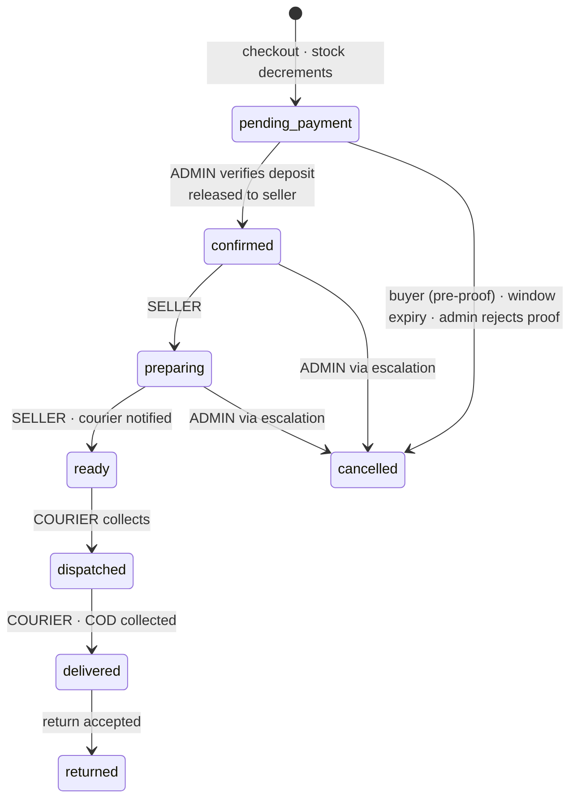

# BETK — v2 SCOPE BASELINE

> **Status:** PROPOSED — for review before the phase re-plan. Nothing here is authorized until §13 is signed.
>
> **What this is.** The re-baselined scope after the cart / multi-seller / courier-delivery decisions.
> It supersedes the frozen v1 constants (59 pages · 43 tables · AC-BUY-6) and becomes the document every
> future task cites. Anything not in here needs an amendment; anything in here is pre-authorized.
>
> **What this is not.** The phase plan. That comes after sign-off.
>
> **Counts are ESTIMATES** until the ERD and UI_SPEC rebuild freezes them. They are marked `~`.

---

## 1. What changed from v1

| | v1 | v2 |
|---|---|---|
| Order creation | Only from a seller-confirmed inquiry (AC-BUY-6) | From a cart |
| Sellers per order | 1 | N — master order over N seller orders |
| Inquiry role | The ordering mechanism | **Price discovery for custom items**, feeding the cart |
| Seller acceptance | Seller accepts, order advances (AC-SEL-14) | **Removed.** Admin approval releases the order to the seller |
| Seller cancellation | — | **Forbidden.** Escalation to admin is the only exit |
| Stock decrement | On seller accept | **On checkout**, restored on expiry/cancel |
| Delivery fee | Flat platform value (`admin_settings`) | **Courier rate matrix** — origin × destination × weight |
| Delivery modes | `{delivery, pickup, remote}` | **Courier delivery only** |
| Buyer payment rails | InstaPay · Vodafone Cash · Orange Cash | **InstaPay only** |
| Pricing | 4 `price_type` variants | **Fixed price on every listing**; custom items may quote within a bounded band |
| Item catalogue | Products + services | **Products only** (services postponed) |
| Buyer sees seller address | Via shipping label | **Never** — courier-mediated end to end |
| Tables · Pages | 43 · 59 | **~50 · ~73** |

**Unchanged and load-bearing:** custodial model (buyer pays BETK, BETK settles net of commission) ·
admin verifies the deposit · no gateway, no automated capture, no automated payouts · in-app
communication only, no counterparty contact affordance · bilingual AR/EN presentation-layer only ·
light/dark theming · Claude Design owns the component kit.

---

## 2. Business rules

### 2.1 Catalogue

- **Physical products only.** `listings.type='service'` blocked at the app layer; the enum member stays
  so services can return without a schema change.
- **Every listing carries a fixed price.** No null-price, no ranged, no `starting_from`, no `per_hour`.
- **Custom items** (`is_made_to_order = true` or the custom-order toggle) additionally permit a quote.
- **Marketplace price eligibility band** — admin-configurable min/max. A listing outside the band cannot
  publish. Admin may change the band for campaigns and seasons.
- **Shipping attributes are mandatory to publish:** weight, and length/width/height.
- **Specs block** — free-form key/value pairs on the listing for buyer-facing detail.
- **Seller categories:** up to **3** (admin-configurable limit), approved at onboarding. A listing
  outside the seller's approved categories cannot be created, edited into, or published.

### 2.2 Custom-item quoting

| Rule | Value |
|---|---|
| Quote floor | The listing's own fixed price |
| Quote ceiling | **2 × the listing price** (asymmetric, admin-configurable) |
| Quote validity | **24 hours** (admin-configurable) |
| Quote carries | Firm price **and** prep time for that item |
| On acceptance | Line enters the cart with the quoted price snapshotted and flagged custom |
| On expiry | Cart line becomes blocked and must be cleared or re-quoted before checkout |

The quote is validated against the tolerance band at send time, so quoting cannot route around the
marketplace eligibility policy.

### 2.3 Cart

Persisted per buyer. Add · remove · change quantity · view subtotal, delivery and total.
Quantity is bounded by live `stock_qty`. A line becomes **blocked** when the item sells out or a custom
quote expires; blocked lines must be cleared before checkout can proceed. Prices are **snapshotted at
add time**, so a later listing or quote edit never silently changes a cart.

### 2.4 Money

| Rule | Value |
|---|---|
| Buyer rail | **InstaPay only**, to BETK's own handle |
| Deposit | **50% of (subtotal + delivery)**, one transfer covering the whole master order |
| Balance | 50%, **COD**, collected by the courier **per shipment** at its own delivery |
| Payment rows | **2 per seller order** — one deposit, one balance |
| Proof | **One** screenshot for the master order |
| Verification | **One** admin action confirms every deposit row under that master |
| Commission | Single flat % of **subtotal only** (never delivery — courier pass-through), admin-configurable, snapshotted per seller order at creation |
| Settlement | BETK → seller via the seller's own handles (InstaPay / Vodafone Cash / Orange Cash) |
| Seller balance | **Derived**, never a ledger table |

### 2.5 Delivery

- **Courier only.** No pickup, no remote, no self-delivery. `delivery_preference` becomes single-valued
  and therefore carries no information.
- **Fee from the courier rate matrix** — origin governorate × destination governorate × weight band.
  Computed per seller order; the buyer sees **one combined delivery total**; each seller order stores
  its own fee for refund and reconciliation.
- **Addresses are never exposed** to buyer or seller. Only admin and the courier see them.
- Courier collects from the seller's pickup address and delivers to the buyer.

### 2.6 Cancellation

| Actor | May cancel | Condition |
|---|---|---|
| **Buyer** | Yes | Only before uploading payment proof |
| **System** | Yes | Payment window expires with no proof |
| **Admin** | Yes | Proof rejected · escalation resolution · exceptional circumstances |
| **Seller** | **Never** | Must escalate |

Every cancellation restores stock (see §2.7), notifies the buyer, and — where a deposit was already
confirmed — triggers a refund.

### 2.7 Stock

- **Decrements at checkout**, inside the order-creation transaction.
- **Restores** on any transition into `cancelled` from a pre-delivery state.
- **Does not restore** on `returned` — a returned good may be damaged; restocking is a seller decision.
- **Out-of-stock escalation sets `stock_qty = 0`** rather than restoring — the seller has just told you
  the item does not exist, and restoring would re-list a phantom.
- Made-to-order and custom items carry `stock_qty NULL` and are skipped entirely.

### 2.8 Fulfilment SLA

- Seller sets **prep days per listing**, capped at **3** (admin-configurable) for catalogue items.
- **Custom items are exempt** — prep time comes from the quote.
- Seller-order deadline = `confirmed_at + MAX(prep_days across its items)`.
- Ladder: reminder at 50% elapsed · urgent at 80% · **breach auto-creates an escalation record**.
- Breach resolution: that seller order is cancelled, the buyer refunded and sent an apology
  notification, and the seller's performance record is affected. **No automatic strike** — admin judgement.

---

## 3. Domain model

**Ownership rules.** The **master** owns the buyer, the delivery address, the single payment proof and
the aggregate status. The **seller order** owns everything a seller or courier acts on: items, its own
delivery fee, its commission snapshot, its prep deadline, its shipment, its two payment rows and its
escalation record.

The single canonical structural diagram is [`BETK_V2_ROLE_JOURNEYS.md`](./BETK_V2_ROLE_JOURNEYS.md) §5.3 —
two drawings of one structure will diverge.

---

## 4. State machines

### 4.1 Seller order

**`confirmed` means admin-approved and with the seller.** It no longer means seller-accepted; there is
no seller acceptance.

### 4.2 Master order — derived, never written directly

| Master state | Condition |
|---|---|
| `awaiting_payment` | No proof uploaded, window running |
| `payment_submitted` | Proof uploaded, awaiting admin |
| `in_progress` | Deposit confirmed; seller orders in flight |
| `completed` | **All** seller orders delivered |
| `partially_completed` | Some delivered, some cancelled |
| `cancelled` | All seller orders cancelled |

Closure remains **derived**, extended to the master: a seller order closes when both its payment rows
are confirmed and it is delivered; the master closes when every child has reached a terminal state.

### 4.3 Payments — per seller order

| Row | Amount | Method | Confirmed by | When |
|---|---|---|---|---|
| `deposit` | 50% of that seller order's (subtotal + delivery) | `instapay` | **ADMIN** | One action, all rows under the master |
| `balance` | remainder | `cod` | **ADMIN** | After the courier remits for that shipment |

---

## 5. Role journeys

See [`BETK_V2_ROLE_JOURNEYS.md`](./BETK_V2_ROLE_JOURNEYS.md). The HTML companion renders the same content.

---

## 6. Seller performance & audit

| Group | Signals | Priority |
|---|---|---|
| **Stock accuracy** | escalation rate · out-of-stock escalations per 100 orders · **days since stock last touched** | **Highest** |
| Fulfilment | delivered vs cancelled/escalated % · avg prep time · SLA breach count · late-ready count |  |
| Responsiveness | quote turnaround · unanswered quote requests · expired-quote rate |  |
| Quality | rating · review count · return rate · dispute rate |  |
| Compliance | agreement version accepted · food docs current · listings within approved categories · active strikes |  |
| Activity | last login · last stock update · last listing edit · active listing count |  |

**Why stock accuracy leads.** Stock decrements at checkout and the seller cannot decline. A seller with
stale stock generates escalations, and every escalation is a buyer whose money was taken for something
that does not exist. Days-since-stock-touched predicts the failure before it happens.

---

## 7. Notifications

Begin at proof upload. **SMS is the launch channel**; WhatsApp and email follow.

| Event | Buyer | Seller | Admin |
|---|:--:|:--:|:--:|
| Quote received / accepted | ✅ | ✅ | — |
| Order placed, awaiting payment | ✅ | — | — |
| Proof uploaded | ✅ | — | ✅ |
| Payment window expiring / expired | ✅ | — | ✅ |
| Payment confirmed | ✅ | ✅ | — |
| Order released to seller | — | ✅ | — |
| Prep reminder 50% / 80% | — | ✅ | — |
| SLA breached | ✅ | ✅ | ✅ |
| Ready for pickup | — | — | ✅ |
| Dispatched · delivered | ✅ | — | — |
| Cancelled (any cause) + apology | ✅ | ✅ | ✅ |
| Escalation raised / resolved | ✅ | ✅ | ✅ |
| Return requested / resolved · refund issued | ✅ | ✅ | ✅ |
| Low stock threshold reached | — | ✅ | — |
| New seller / food onboarding | — | — | ✅ |
| Payout processed | — | ✅ | — |

---

## 8. Legal & compliance

| Document | Engineering surface |
|---|---|
| Buyer Terms & Conditions | Public page · acceptance captured (**N26**: at signup or first checkout) |
| Seller Agreement | Public page · **e-signature at onboarding**: version, timestamp, seller id, status, optional IP/device |
| Return & Refund Policy | Public page · its rules drive the return flow |
| Privacy Policy | Public page — required, and absent from the source spec |

Versioning implies **re-acceptance when a version changes**. Content is lawyer-authored; the engineering
work is the pages, the capture and the version gate. **Longest external lead time — start now.**

---

## 9. Admin configuration

**Configurable:** price eligibility band · commission % · custom-quote tolerance (default 2×) · quote
validity (24h) · payment window (recommend **30 min** at launch, not 15 — stock is held for its whole
duration and after-hours transfers are slow) · prep cap (3 days) · seller category limit (3) · courier
rate matrix · return window · food requirements · low-stock threshold default.

**Deliberately NOT configurable:** order statuses (they drive RLS, triggers and the stock decrement —
a code contract, not config) · whether sellers may cancel · whether buyers may cancel after payment.
Configurable money-flow rules multiply the state space and every combination needs testing.

---

## 10. Revised inventory (estimates)

### New tables (~+7 → **~50**)

`cart_items` · `master_orders` · `returns` · `agreement_acceptances` · `store_categories` ·
`courier_rates` · (`return_evidence` — **N25**: or reuse `dispute_evidence`)

**Not new:** escalation is **columns on the seller order** (`escalated_at`, `reason`, `note`,
`resolved_at`), not a table. Food verification reuses `seller_documents` with new types. Specs are a
JSONB column on `listings`.
**Renamed:** `orders` → **`seller_orders`**.

### New columns (indicative)

`listings`: weight, length, width, height, specs JSONB, prep_days ·
`stores`: pickup address fields · `inquiries`: quoted_price, quote_expires_at, quoted_prep_days ·
`seller_orders`: master_order_id, escalation fields · `master_orders`: proof_path (**N22**)

### Dead — retained but blocked at the app layer (REG-63 pattern)

`price_type` members other than `fixed` · `payment_method` members `vodafone_cash` / `orange_cash` on
the **buyer** side · `delivery_preference` (single-valued) · **the entire `StoreDeliveryOptions` JSONB**
on both `stores` and `listings` · `cod_enabled` · `listings.type='service'`

### New pages (~+14 → **~73**)

`/cart` · `/legal/terms` · `/legal/seller-agreement` · `/legal/returns` · `/legal/privacy` ·
`/returns` · `/returns/[id]` · `/seller/returns` · `/seller/returns/[id]` · `/admin/returns` ·
`/admin/escalations` · `/admin/ready-for-pickup` · `/admin/sellers/[id]/performance` ·
`/orders/[masterId]/[sellerOrderId]`

**Repurposed:** `/seller/store/delivery` → **pickup address** page.
**Removed:** delivery-method selection at checkout.

---

## 11. Disposition of existing artifacts

### Scope decisions

| | Fate |
|---|---|
| OD-1, OD-2, OD-3, OD-4, OD-5, OD-7 | **Hold unchanged** |
| OD-6 (43 tables) | **Superseded** by the v2 count |
| OD-8 custodial payments | **Amended** — still custodial; now InstaPay-only, 2 rows per *seller order*, deposit on subtotal+delivery, **no seller acceptance gate** |

### ADRs

| | Fate |
|---|---|
| ADR-016 custodial (supersedes ADR-002) | Holds, amended per OD-8 above |
| ADR-017 `converted_to_order_id` trigger | **Rework** — the inquiry now feeds a cart line, not an order |
| ADR-018 checkout atomicity | **Redo** — one transaction now spans master + N seller orders + N item sets + 2N payment rows |
| ADR-019 three-layer write model | **Holds** — re-scope to the new tables. The pattern is unchanged and proven |
| ADR-001…015 | Review individually at the re-plan; most are auth//infra and unaffected |

### Register

| REG | Fate |
|---|---|
| REG-14 delivery modes · REG-53 modes derive from category | **Close** — single mode |
| REG-44 seller cannot read buyer name | **Closes by removal** — the seller never needs it |
| REG-65 dead delivery-fee fields · D9 · D10 | **Close by deletion** — the whole JSONB dies |
| REG-56 derived closure | **Amend** — extend to the master |
| REG-62 payment config gate | **Narrows** to `betk_instapay_handle` alone |
| REG-49 policies | **Re-scope** to the new tables; reasoning survives intact |
| REG-73 (D6 cancel comment) | **Resolved** by the new cancellation rules |
| REG-63 `cod_enabled` · REG-64 stale copy · REG-70 `moderation_target` | Still open, unchanged |
| REG-72 storefront link (CD-DELTA) · REG-74 Guard G · REG-47 Guard E · REG-67 Guard F | Still open, unaffected |
| REG-11 · REG-19 · REG-24 · REG-26 · REG-33 · REG-36 · REG-40 | Standing / unaffected |

### Build

**Survives:** all of phases 01–05 · the design system · every process artifact (PRECEDENTS, register,
guard suite, migration discipline) · `requireAdmin` / `requireVerifiedPhone` / `requireActiveUser` ·
the private-bucket proof upload · admin deposit verification and the `/admin/payments` slice ·
the derived-balance rule.

**Rebuilt:** `create_order_from_inquiry` rpc · `/checkout` · `/orders` · the order-set RLS scoping ·
the `order_status` enum.

**Repurposed:** Phase 06 messaging becomes the **quote channel** rather than the ordering channel.

---

## 12. Hard pre-launch gates

| Gate | Content |
|---|---|
| **REG-62 (narrowed)** | `betk_instapay_handle` set · commission % set · price band set |
| **Courier gate (N1/N15)** | Rate matrix numbers · order-handoff mechanism (API or manual) · coverage map |
| **Legal gate (Q12)** | Buyer T&C · Seller Agreement · Return Policy · Privacy Policy, lawyer-reviewed and published |

---

## 13. Open questions

Questions retained (not deleted). Answers signed 2026-09-03 (V2-STATE-RECORD). Do not re-open except **N22**, which B3 may override with a stated, cited reason.

| # | Question | Status |
|---|---|---|
| **N21** | Guest cart: client-side and merged at login, or login required to add? | **ANSWERED:** No guest cart. An account is required before the first add-to-cart. |
| **N22** | Payment proof on the **master order** (recommended — one transfer, one proof) or replicated across each deposit row? | **ANSWERED-WITH-DIRECTION** (pending B3 / ERD rewrite validation): ONE payment proof at MASTER-ORDER level. DIRECTION: each child seller order's deposit row SNAPSHOTS the proof reference at verification time, giving durable per-order traceability for later disputes, rather than resolving it only through the parent by join. B3 (the ERD rewrite) VALIDATES this against the existing architecture and may override it only with a stated, cited reason. |
| **N23** | Confirm the quote band reads as `[listing price, 2 × listing price]` — never below the listing price | **ANSWERED:** Custom-item quoting: the seller may quote up to 2x the original/requested listing price. Band = [listing price, 2x listing price]. Never below the listing price. Valid 24h. The quote also states that item's prep time. |
| **N25** | Returns reuse `dispute_evidence`, or get their own evidence table? | **ANSWERED:** Returns get a DEDICATED returns-evidence table. Do NOT reuse `dispute_evidence` — different lifecycle and purpose, keep them cleanly separated. |
| **N26** | Buyer T&C acceptance at signup, or at first checkout? | **ANSWERED:** Terms acceptance at SIGNUP, and version-gated re-confirmation before any order can complete. `agreement_acceptances` therefore covers BUYERS as well as sellers. |
| **N27** | Staging carries 7 undeletable zombie orders and a live seller account under the v1 model. Reset the staging schema before the v2 build, or migrate forward? | **ANSWERED:** Staging MIGRATES, it does not reset. Preserve current state and migrate it, so the migration path itself is validated. |
| **N28** | Does the seller see the **buyer's city** for prep/packing purposes, or nothing at all? | **ANSWERED:** Sellers see NO buyer location — not address, not city. Order ref + items + prep deadline only. |

## 14. Sign-off

| Section | Approve |
|---|---|
| §2 Business rules | |
| §3 Domain model | |
| §4 State machines | |
| §5 Role journeys | |
| §6 Performance & audit | |
| §7 Notifications | |
| §8 Legal | |
| §9 Configuration | |
| §10 Inventory estimates | |
| §11 Artifact disposition | |
| §13 Open questions answered | |

On sign-off I produce: the phase re-plan from 07 onward · the frozen v2 page and table inventory ·
the ERD delta · and the rewritten PRD / MVP_SCOPE / UI_SPEC / BETK_PHASES baseline.
